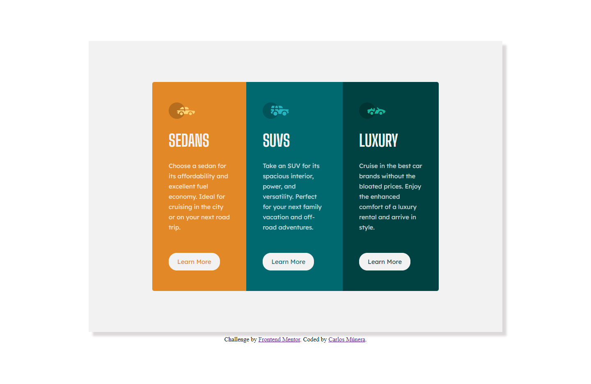

# Frontend Mentor - 3-column preview card component

Solución para el reto [QR code component challenge on Frontend Mentor](https://www.frontendmentor.io/challenges/3column-preview-card-component-pH92eAR2-).

### Captura de pantalla

Desktop - Screen Width: 1440px

Mobile - Screen Width:375px

### Links

- URL de la solución: [Solución.]()

### Reto construido con:

- Semantic HTML5 markup
- CSS custom properties
- Flexbox
- Desktop-first workflow

## Author

- Frontend Mentor - [@CarlosMunera](https://www.frontendmentor.io/profile/CarlosMunera)

